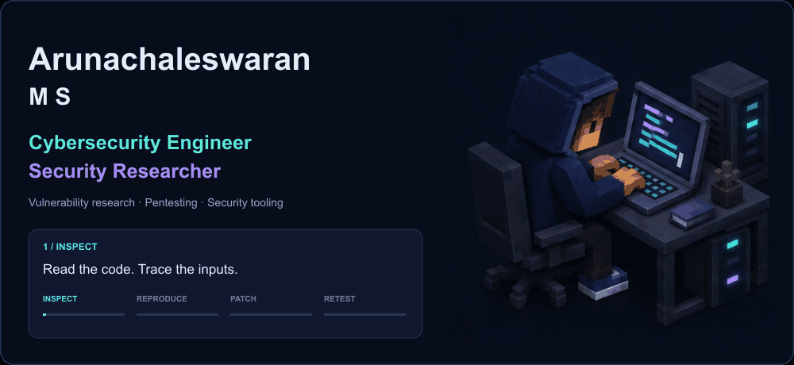
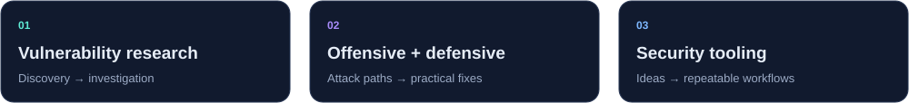
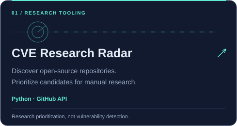
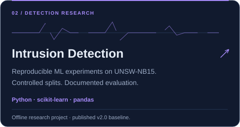
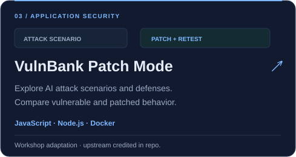
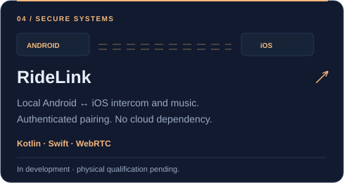
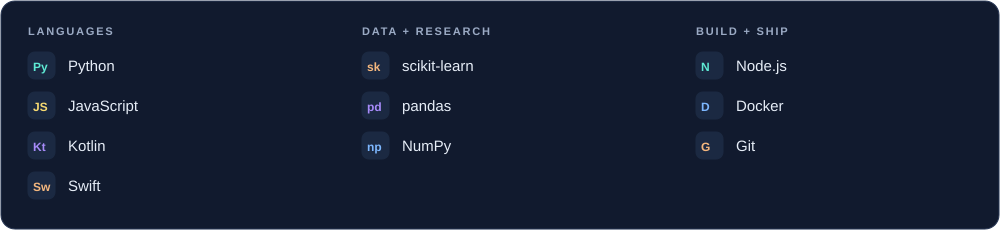
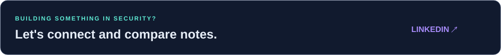

  <picture>
    <source media="(max-width: 600px) and (prefers-reduced-motion: reduce)" srcset="assets/hero-mobile-static.png" />
    <source media="(max-width: 600px)" srcset="assets/hero-mobile.gif" />
    <source media="(prefers-reduced-motion: reduce)" srcset="assets/hero-static.png" />
    
  </picture>

  
  

<b>Cybersecurity Engineer &nbsp; · &nbsp; Security Researcher</b> 
I investigate attack paths, build security tools, and test defensive ideas through practical projects.

  <a href="#selected-projects">Projects</a> &nbsp; · &nbsp;
  <a href="#project-stack">Tech stack</a> &nbsp; · &nbsp;
  <a href="#github-activity">Activity</a> &nbsp; · &nbsp;
  <a href="https://www.linkedin.com/in/arunachaleswaranms">Connect</a>

## Selected projects

From research tooling and detection experiments to patching an AI-security workshop and building authenticated local systems. Open a card for the code, methodology, and current status.

  
  
   
  
  

<b>Project index / text version</b>

- [CVE Research Radar](https://github.com/arunachaleswaranms/cve-research-radar) — Python CLI for discovering and prioritizing repositories for manual CVE research.
- [Cyber Intrusion Detection System](https://github.com/arunachaleswaranms/Cyber-Intrusion-Detection-System) — reproducible offline detection experiments, controlled data splits, and documented evaluation.
- [VulnBank Patch Mode](https://github.com/arunachaleswaranms/vulnbank-patch-mode-lab) — an adaptation of an upstream AI-security workshop, with vulnerable and patched modes.
- [RideLink](https://github.com/arunachaleswaranms/RideLink) — local intercom and music synchronization across Android and iOS. Physical qualification remains pending.

## Project stack

Technologies represented in the projects above.

## GitHub activity

  
  

Live cards use publicly available GitHub data and may refresh at different times. Contributions include more than commits. <a href="https://github.com/arunachaleswaranms?tab=overview">View the native contribution calendar ↗</a>

  

